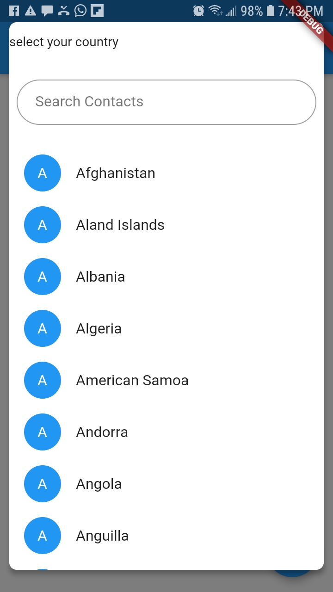
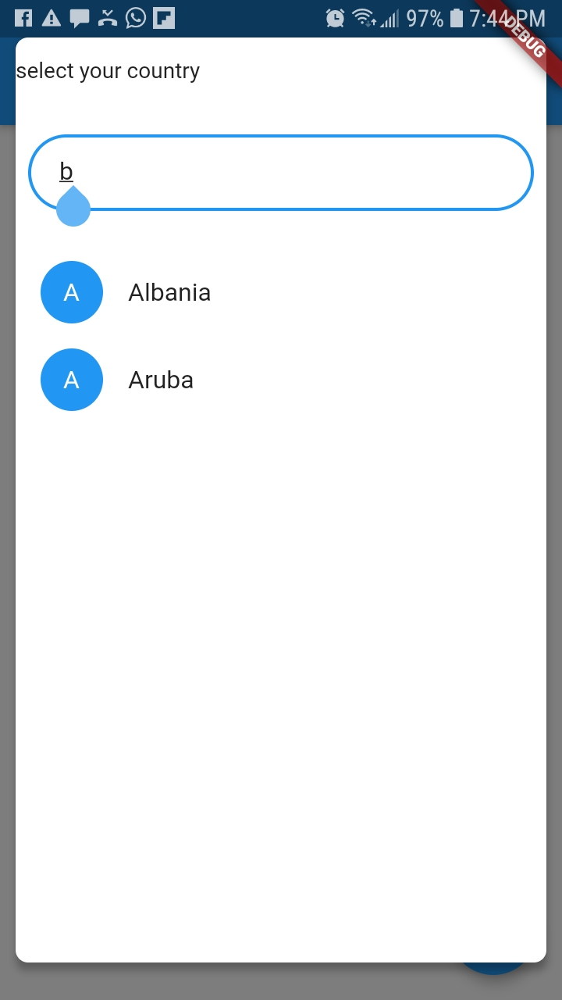
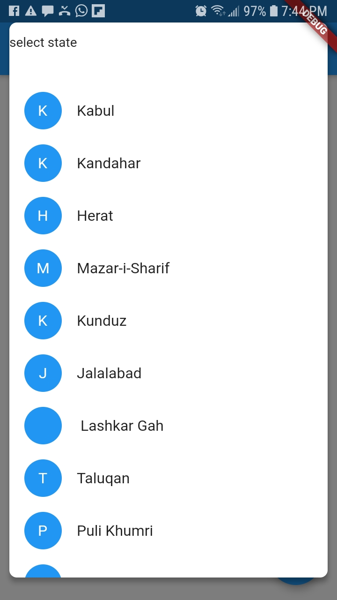

# flutter_country_state

A new Flutter package that displays a country with its respective state.
### show some :heart: and star the repo to support the project.

## Screenshots
   

##Usage

[Example](https://github.com/mimi-tech/flutter_country_state/tree/master/example)

To use this package :
* add the dependency to your [pubspec.yaml](https://github.com/mimi-tech/flutter_country_state/tree/master/pubspec.yaml) file.
```
dependencies:
  flutter:
    sdk: flutter
  flutter_country_state:
  ```

  ###How to Use
  ``` dart
  class Country extends StatefulWidget {
    @override
    _CountryState createState() => _CountryState();
  }

  class _CountryState extends State<Country> {
    @override
    Widget build(BuildContext context) {
      return Column(
        children: <Widget>[
          Text( Variables.pstate ),
          Text( Variables.property_country ),
          Container(child:  showCountry(),)
          Container(child: StateDialog(),)
        ],
      );
    }
  }

# Licence
MIT Licence.

## Getting Started

This project is a starting point for a Dart
[package](https://flutter.dev/developing-packages/),
a library module containing code that can be shared easily across
multiple Flutter or Dart projects.

For help getting started with Flutter, view our 
[online documentation](https://flutter.dev/docs), which offers tutorials, 
samples, guidance on mobile development, and a full API reference.
